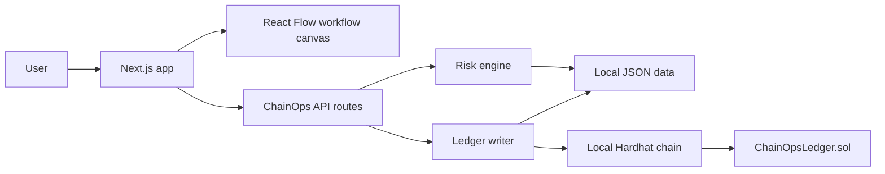

# fluo

fluo is a local proof of concept for defence procurement workflow control and audit logging. It models how a Canadian defence organization could route a procurement document, evaluate vendor risk, block risky workflow paths, surface affected projects, and write audit events to a local blockchain ledger.

This is a demo system. It does not connect to CanadaBuys, DND, sanctions lists, Controlled Goods systems, identity providers, payment rails, or production databases.

## What It Does

- Opens a CFB Gagetown organization workspace.
- Displays a Radar Support Equipment procurement workflow.
- Renders vendor, part-origin, workflow, and ledger nodes on a React Flow canvas.
- Checks local JSON vetting data before a vendor is accepted.
- Blocks workflow progress when a vendor is flagged.
- Shows related projects affected by the same vendor.
- Records procurement events in a local Solidity ledger.
- Stores readable demo audit history in JSON for the UI.

## Architecture



## Tech Stack

- **App:** Next.js, React 19, TypeScript
- **UI:** Tailwind CSS, lucide-react, React Flow through `@xyflow/react`
- **Ledger:** Solidity, Hardhat, ethers v6
- **Data:** local JSON files in `open-agent-builder/data`
- **Runtime:** Node.js and npm

## Repository Layout

```txt
.
|-- README.md
`-- open-agent-builder/
    |-- app/                         # Next.js routes and API endpoints
    |-- components/chainops/          # Workflow, workspace, and ledger UI
    |-- contracts/ChainOpsLedger.sol  # Demo audit-ledger contract
    |-- data/                         # Local demo data
    |-- lib/blockchain/               # Ledger write helpers
    |-- lib/chainops/                 # JSON store and risk engine
    |-- public/                       # Static images and favicon
    `-- scripts/                      # Dev, deploy, and check scripts
```

## Local Demo

Run the app from the project folder:

```bash
cd open-agent-builder
npm install
npm run dev
```

`npm run dev` starts a local Hardhat chain, deploys `ChainOpsLedger.sol`, writes the contract address to `data/contract-address.json`, and starts the Next.js app.

Useful checks:

```bash
npm run chain:compile
npm run spec-check
npm run build
```

## Demo Data

The demo state is stored in JSON:

- `organizations.json`
- `documents.json`
- `workflows.json`
- `vendors.json`
- `parts.json`
- `projects.json`
- `relationships.json`
- `ledger-events-cache.json`
- `contract-address.json`

The blockchain ledger stores event metadata and payload hashes. The JSON cache keeps the audit trail readable in the demo UI.

## Scope

- No production database
- No real authentication
- No external procurement integration
- No public-chain deployment
- No classified or official government connectivity
- One demo smart contract: `ChainOpsLedger.sol`

## Source References

The active codebase is a narrowed fluo demo built from selected patterns in:

- `firecrawl/open-agent-builder` for the Next.js workflow-builder base
- `faizack/Supply-Chain-Blockchain` for Solidity, Hardhat, and contract interaction patterns
