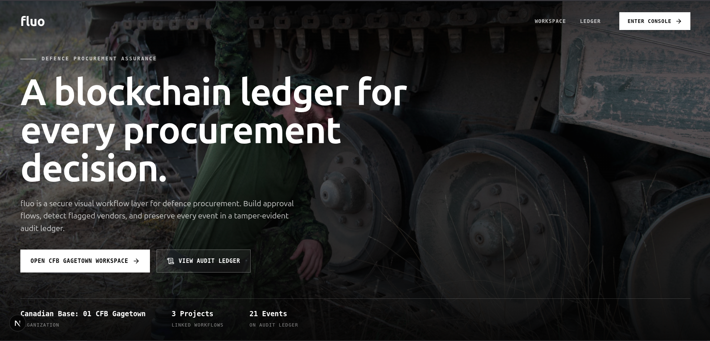

# fluo



fluo is a proof-of-concept defence procurement workflow and audit ledger. It demonstrates how a Canadian defence organization could run approval workflows, flag risky vendors, propagate risk across related projects, and preserve key procurement events in a tamper-evident blockchain log.

This is not a production procurement system. It has no real CanadaBuys, DND, sanctions, Controlled Goods, identity, or payment integrations. The goal is to prove the workflow, risk-detection, and audit-ledger pattern with a local demo.

## What It Shows

- A CFB Gagetown organization workspace.
- A procurement document with a visual approval workflow.
- Vendor and part-origin nodes rendered on a React Flow canvas.
- Local JSON vetting data that can mark a vendor as clear or flagged.
- Automatic blocking of flagged vendors in the workflow.
- Affected-project propagation when the same vendor appears elsewhere.
- A local Solidity ledger that records event metadata and payload hashes.
- A readable local JSON cache for demo audit events.

## Tech Stack

- **Frontend:** Next.js canary, React 19, TypeScript, Tailwind CSS, lucide-react.
- **Workflow canvas:** `@xyflow/react` / React Flow-style nodes and edges.
- **Blockchain:** Solidity, Hardhat, ethers v6.
- **Data layer:** Local JSON files under `open-agent-builder/data/`.
- **Runtime:** Node.js/npm.
- **Design reference:** `stitch_flu_procurement_workflow_interface/` for the sharp monochrome fluo interface language.

## Repositories Used

- **`firecrawl/open-agent-builder`**: main UI base for the visual workflow builder.
  - Source: https://github.com/firecrawl/open-agent-builder
  - Used for the workflow-builder foundation, Next.js/React structure, canvas experience, and app shell.

- **`faizack/Supply-Chain-Blockchain`**: blockchain reference only.
  - Source: https://github.com/faizack/Supply-Chain-Blockchain
  - Used for Solidity, Hardhat, deployment, and frontend-to-contract interaction patterns.

The active app is not a full copy of either product. It is a narrowed proof of concept built around the fluo procurement scenario.

## Repository Layout

```txt
.
|-- README.md
|-- docs/assets/fluo-console.png
|-- open-agent-builder/
|   |-- app/                         # Next.js routes and API endpoints
|   |-- components/chainops/          # fluo workflow, workspace, ledger UI
|   |-- contracts/ChainOpsLedger.sol  # single demo audit-ledger contract
|   |-- data/                         # local JSON demo data
|   |-- lib/blockchain/               # ledger write/cache helpers
|   |-- lib/chainops/                 # JSON store and risk engine
|   `-- scripts/                      # dev, deploy, and spec-check scripts
|-- Supply-Chain-Blockchain/          # source reference kept as ordinary files
`-- stitch_flu_procurement_workflow_interface/
```

There is one Git repository at this root. The nested source clones have been flattened into this workspace and should not keep their own `.git` directories.

## Local Demo

From the main app folder:

```bash
cd open-agent-builder
npm install
npm run dev
```

`npm run dev` starts a local Hardhat chain, deploys `ChainOpsLedger.sol`, writes the deployed address to `data/contract-address.json`, and starts the Next.js app.

Useful checks:

```bash
npm run chain:compile
npm run spec-check
npm run build
```

## Demo Data

Readable demo state lives in JSON files:

- `organizations.json`
- `documents.json`
- `workflows.json`
- `vendors.json`
- `parts.json`
- `projects.json`
- `relationships.json`
- `ledger-events-cache.json`
- `contract-address.json`

The blockchain is only the tamper-evident log. The UI reads human-friendly demo state from JSON.

## Scope Boundaries

- No production database.
- No real authentication.
- No external procurement-system integration.
- No public-chain deployment.
- No classified or official government system connectivity.
- No generalized supply-chain DApp UI.
- One Solidity contract only: `ChainOpsLedger.sol`.

## Current Status

The proof of concept is focused on a single Canadian defence procurement scenario:

1. Open the CFB Gagetown workspace.
2. Open the Radar Support Equipment procurement workflow.
3. Drag or evaluate a vendor node.
4. The risk engine checks local vetting JSON.
5. A flagged vendor blocks the workflow path.
6. Related projects using the same vendor are surfaced.
7. The event is logged to the local blockchain ledger and cached in JSON for display.
